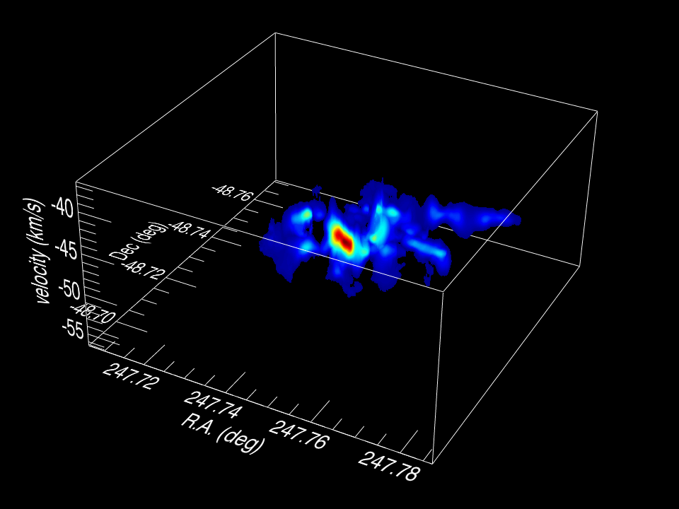

# astro-realm : Astronomy - Radio galaxy Evolution analysis using ALma and Muse (REALM)

## Background

This customised software package provides functionality for performing data extraction, analysis and visulisation of astronomical datacubes. 

The data have been acquired using <a href="https://www.almaobservatory.org/en/home/">Atacama Large Milimeter-submilimeter Array (ALMA)</a> located in the Chajnantor Plateau in the Chilean Andes. ALMA is an interferometer array comprising 66 antennae. It images millimeter/sub-millimeter wavelengths and was one of the many remarkable instruments used to form the black-hole image for the Event Horizon Telescope very long baseline astronomy project. 

ALMA produces raw data that is calibrated and then imaged to form image cubes - tensors containing pixels counts. The image cube is represented by Cartesian co-ordinates (x,y,z) which are mapped onto (right ascension, declination, velocity). This three-dimensional format is illustrated in the figure below which shows an ALMA datacube image of two  merging stars.

## The Project

In this project, the datacubes images are of a sample of seven radio galaxies. The milimeter/sub-milimeter data allow us to constrain the kinematics, mass and structure of the molecular hydrogen gas surrounding the galaxies and traced by the fine-structure atomic carbon line, [CI](1-0), which emits at a rest frequency 492 GHz. 

## Usage

The repository contains Python modules used to carry out a specific data analysis using ALMA, MUSE and ancillary Hubble Space Telescope (HST), Spitzer Space Telescope (SST) and VLA datasets. 

A test module is included in addition to test datasets from the data sources:

- <a href="http://archive.eso.org/cms.html">ESO Archive</a>
- <a href="https://archive.stsci.edu/hst/">HST Archive</a>
- <a href="https://irsa.ipac.caltech.edu/data/SPITZER/docs/spitzerdataarchives/">SST Archive</a>
- <a href="https://science.nrao.edu/facilities/vla/archive/index">VLA Archive</a>

Python libraries used:
- Astronomy: MPDAF, AstroPy, WCS
- Linear algebra & calculus: SciPy, NumPy, Math
- Visualization: Matplotlib
- Model fitting: LMFIT
- Others: Warnings, Itertools

[1] Image Credit: <a href="http://irfu.cea.fr/Projets/COAST/">Computational Astrophysics at Saclay</a>
